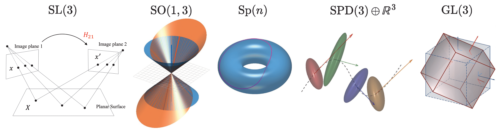
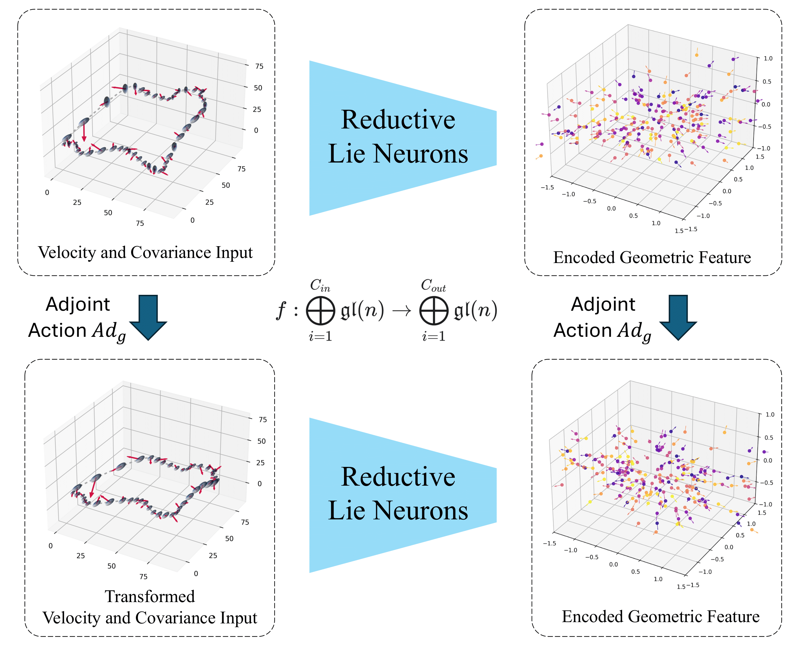

# Equivariant neural networks for general linear symmetries on Lie algebras

**Official PyTorch implementation of "Reductive Lie Neurons"**
<br>
*(Currently Under Review for ICLR 2025)*

**Chankyo Kim¹*, Sicheng Zhao*, Minghan Zhu¹², Tzu-Yuan Lin³, Maani Ghaffari¹**
<br>
¹University of Michigan, ²University of Pennsylvania, ³Massachusetts Institute of Technology
<br>
*Equal contribution.

[Project Website (Coming Soon)](#) | [Paper on ArXiv (Coming Soon)](#)

---

## About

Encoding symmetries is a powerful inductive bias for improving the generalization of deep neural networks. However, most existing equivariant models are limited to simple symmetries like rotations, failing to address the broader class of general linear transformations, GL(n), that appear in many scientific domains. We introduce **Reductive Lie Neurons (ReLNs)**, a novel neural network architecture exactly equivariant to these general linear symmetries.


*ReLNs are applicable to a wide range of scientific domains governed by diverse Lie group symmetries, from physics and robotics to computer vision.*

Unlike previous methods like [LieNeurons](https://github.com/UMich-CURLY/LieNeurons), which are tailored for semi-simple Lie algebras (e.g., `so(3)`), our work introduces a general approach to construct **non-degenerate bilinear forms for any `n x n` matrix Lie algebra**, including reductive ones like `gl(n)`. This allows for the principled design of equivariant layers and nonlinearities for a much broader class of symmetries.

This repository provides the official code to reproduce the experiments in our paper.

---

## Core Concept: Adjoint Equivariance by Design

A key contribution of our work is a unified framework that embeds diverse geometric inputs (like vectors and covariance matrices) into a common Lie algebra, where they transform consistently under the **adjoint action**. Our network is designed to commute with this action, guaranteeing equivariance.


*Our network `f` is provably equivariant. A transformation `Ad_g` on the input results in the same transformation `Ad_g` on the output feature.*

To achieve this for general reductive algebras like `gl(n)`, we introduce a non-degenerate, Ad-invariant bilinear form:

`B(X, Y) = 2n * tr(XY) - tr(X)tr(Y)`

This form is the fundamental tool used to build our equivariant layers. Here’s a simple code snippet demonstrating how it creates an invariant feature:

```python
# From core/layers.py
import torch

class LNInvariant(nn.Module):
    """
    Computes an invariant scalar feature from a Lie algebra element
    using our non-degenerate bilinear form.
    """
    def __init__(self, in_channels, algebra_type='gl3'):
        super(LNInvariant, self).__init__()
        self.hat_layer = HatLayer(algebra_type) # Maps vector to matrix
        self.algebra_type = algebra_type

    def forward(self, x):
        """
        Input x: Lie algebra vectors
        Output: Invariant scalars
        """
        # 1. Map vector representation to matrix representation
        x_hat = self.hat_layer(x)

        # 2. Compute the invariant using the bilinear form B(X, X)
        invariant_scalar = killingform(x_hat, x_hat, self.algebra_type)

        # 3. Aggregate features (e.g., via mean)
        return invariant_scalar.mean(dim=[-2, -1])
```

For a more detailed interactive example, please see our [Toy Problem Notebook](examples/toy_problem.ipynb).

---

## Installation

To set up the environment, please follow these steps:

```bash
# Clone the repository
git clone [https://github.com/chankyo123/reductive-lie-neuron.git](https://github.com/chankyo123/reductive-lie-neuron.git)
cd reductive-lie-neuron
```
Each experiment has its own set of dependencies. Please refer to the `README` file within each experiment's directory (e.g., `experiments/lorentznet/`) for specific installation instructions.

---

## Reproducing Paper Results

All experiment scripts are located in the `experiments/` directory. For each experiment, first download the required dataset and place it in the corresponding `data/` subfolder.

### Algebraic Benchmarks (`sl(3)` and `sp(4)`)
These experiments reproduce the Platonic Solid Classification and `sp(4)` Invariant Function Regression results. Our model directly adopts the architecture from Lie Neurons, replacing only the bilinear form.

For detailed instructions on data generation, training, and evaluation for these benchmarks, please refer to the original **[LieNeurons GitHub repository](https://github.com/UMich-CURLY/LieNeurons)**.

### Particle Physics: Top-Tagging (`SO(1,3)`)
This experiment reproduces the Top-Tagging benchmark results. The following command trains our ReLN-based model.

```bash
# Navigate to the experiment directory
cd experiments/lorentznet/

# Run training
torchrun --nproc_per_node=1 top_tagging.py \
    --batch_size=32 \
    --epochs=35 \
    --warmup_epochs=4 \
    --n_layers=5 \
    --n_hidden=48 \
    --lr=0.001 \
    --weight_decay=0.01 \
    --exp_name=reln_top_tagging_repro \
    --datadir ./data/toptag/
```

### Drone State Estimation (`SO(3)` with Uncertainty)
This experiment reproduces the drone trajectory estimation results. The main script allows you to train different model architectures by changing the `--arch` flag.

**To train our best-performing model (ReLN with log-covariance):**
```bash
# Navigate to the experiment directory
cd experiments/velocity_learning/

# Run training for the main ReLN model
python3 src/main_net.py \
    --mode train \
    --root_dir ./data/drone_trajectories/ \
    --out_dir ./results/reln_log_cov/ \
    --epochs 200 \
    --arch ln_resnet_cov \
    --input_dim 6 
```

**To train other baseline models for comparison:**

You can reproduce the ablation studies in our paper by changing the `--arch` flag. Key architectures include:

* `--arch resnet`: Non-equivariant ResNet baseline.
* `--arch vn_resnet`: Equivariant Vector Neurons (VN) baseline (velocity only).
* `--arch vn_resnet_cov`: VN baseline adapted for covariance.
* `--arch ln_resnet`: Our ReLN model using only velocity information.

---

## Citation

Our paper is currently under review. If you find our work useful, please cite the ArXiv preprint (link will be available here soon).

```bibtex
@misc{kim2024reductive,
      title={Equivariant neural networks for general linear symmetries on Lie algebras}, 
      author={Chankyo Kim and Sicheng Zhao and Minghan Zhu and Tzu-Yuan Lin and Maani Ghaffari},
      year={2024},
      eprint={24XX.XXXXX},
      archivePrefix={arXiv},
      primaryClass={cs.LG}
}
```