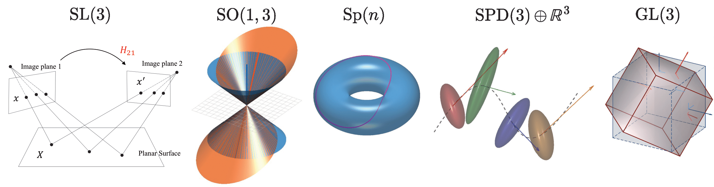

<h1 align="center">Reductive Lie Neurons (ReLNs)</h1>
<h3 align="center">Equivariant Neural Networks for General Linear Symmetries on Lie Algebras</h3>

<p align="center">
  Chankyo Kim<sup>1*</sup>&nbsp;&nbsp; Sicheng Zhao<sup>1*</sup>&nbsp;&nbsp; Minghan Zhu<sup>1,2</sup>&nbsp;&nbsp; Tzu-Yuan Lin<sup>3</sup>&nbsp;&nbsp; Maani Ghaffari<sup>1</sup>
  <br>
  <sup>1</sup>University of Michigan&nbsp;&nbsp; <sup>2</sup>University of Pennsylvania&nbsp;&nbsp; <sup>3</sup>MIT&nbsp;&nbsp;&nbsp;<sup>*</sup>Equal contribution
</p>

<p align="center">
  <a href="https://arxiv.org/abs/2510.22984"></a>
  <a href="https://reductive-lie-neuron.github.io/"></a>
  
  <a href="LICENSE"></a>
</p>

<p align="center">
  
</p>

> **TL;DR** &mdash; Most equivariant networks only handle simple symmetries like rotations. **ReLNs** are exactly
> equivariant to *general linear* symmetries **GL(n)**, operating directly on Lie-algebraic features and matrix-valued
> inputs through a single adjoint-invariant bilinear layer &mdash; no per-subgroup redesign.

---

## About

Encoding symmetries is a powerful inductive bias for deep networks, but most equivariant models are limited to compact
groups such as rotations and cannot address the broader class of general linear transformations **GL(n)** that appear
across science. **Reductive Lie Neurons (ReLNs)** are exactly equivariant to these general linear symmetries and operate
directly on structured inputs, including general `n×n` matrices.

The key ingredient is a non-degenerate, **adjoint-invariant bilinear form** defined for any reductive matrix Lie algebra
(e.g. `gl(n)`), generalizing the Killing form (which is degenerate on `gl(n)`):

```
B(X, Y) = 2n·tr(XY) − tr(X)·tr(Y)
```

Because `B` is invariant under the adjoint action `Ad_g` for any `g ∈ GL(n)`, the layers built on top of it are
equivariant by construction. Unlike prior methods such as [Lie Neurons](https://github.com/UMich-CURLY/LieNeurons)
(restricted to semi-simple algebras like `so(3)`, `sl(3)`), ReLNs handle reductive algebras and matrix-valued data
within one framework.

---

## Repository structure

This repository bundles the three experiment suites from the paper, each runnable on its own, plus the shared
equivariant-layer library.

| Path | What it is |
|------|------------|
| [`relns/`](relns/) | **Core library + algebraic benchmarks.** Equivariant layers in [`core/`](relns/core/); `sl(3)`, `sp(4)`, `gl(2)` and Platonic-solid experiments in `experiment/`. |
| [`LorentzNet-release/`](LorentzNet-release/) | **Particle physics (Lorentz group `SO(1,3)`).** Top-tagging / quark-gluon-tagging with a ReLN-modified LorentzNet. |
| [`velocity-learning/`](velocity-learning/) | **3D drone state estimation (`SO(3)` + uncertainty).** Jointly learns velocity and covariance for trajectory estimation. |
| [`system-id/`](system-id/) | **GL(n) system identification.** Native full-`GL(n)` adjoint-equivariance benchmark: recover global dynamics `A` from noisy local least-squares estimates under basis changes `A ↦ T A T⁻¹`. |
| [`examples/quickstart.py`](examples/quickstart.py) | A 60-second tour of the core library (run this first). |
| [`figures/`](figures/) | Figures used in the paper and this README. |

### The core library — `relns/core/`

- [`lie_alg_util.py`](relns/core/lie_alg_util.py) — `HatLayer` (vector ↔ matrix), `vee`, and
  `killingform` (the adjoint-invariant bilinear form `B`). Supports `so3`, `sl3`, `sl4`, `sp4`, `gl2`, `gl3`, `gl4`, `se3`.
- [`reln_layers.py`](relns/core/reln_layers.py) — equivariant building blocks:
  `ReLNLinear`, `ReLNKillingRelu`, `ReLNLieBracket`, `ReLNLinearAndKillingRelu`, `ReLNInvariant`, `ReLNMaxPool`, `ReLNBatchNorm`, …
- [`vn_layers.py`](relns/core/vn_layers.py) — Vector Neurons (`SO(3)`) baseline layers.

---

## Installation

```bash
git clone https://github.com/chankyo123/reductive-lie-neuron.git
cd reductive-lie-neuron
```

The core library needs `torch`, `numpy`, and `einops`:

```bash
pip install torch numpy einops pyyaml
```

Each experiment has additional, sometimes conflicting, dependencies (different particle-physics / robotics stacks), so
we keep them isolated. See the per-directory README and `requirements.txt`:
[`LorentzNet-release/requirements.txt`](LorentzNet-release/requirements.txt),
[`velocity-learning/requirements.txt`](velocity-learning/requirements.txt) (or `environment.yaml`).

---

## Quick start

Run the guided tour, which verifies the adjoint invariance of the bilinear form and runs a small equivariant stack:

```bash
python examples/quickstart.py
```

Using the core library directly:

```python
import torch
from core.lie_alg_util import HatLayer, killingform   # run from relns/

hat = HatLayer("gl3")                       # maps a 9-vector to a 3x3 matrix in gl(3)
X, Y = torch.randn(9), torch.randn(9)

# Adjoint-invariant scalar  B(X, Y) = 2n·tr(XY) − tr(X)tr(Y)
B = killingform(hat(X), hat(Y), algebra_type="gl3")
```

---

## Reproducing the paper experiments

The benchmarks are ordered by the paper's roadmap — from tasks whose **native symmetry is the full `GL(n)`**, through
tasks with **`GL(n)`-structured (center-sensitive) inputs**, to **semisimple foundations / compatibility** checks:

| Regime | Benchmark(s) | Where |
|--------|--------------|-------|
| **① Native full `GL(n)`** | System identification (similarity `A ↦ T A T⁻¹`) | [`system-id/`](system-id/) |
| **② `GL(n)`-structured inputs** (center-sensitive: covariance, scale) | Drone state estimation · 3D Gaussian Splatting | [`velocity-learning/`](velocity-learning/) · separate release |
| **③ Foundations & compatibility** (semisimple) | `sl(3)` / `sp(4)` algebraic · Lorentz top-tagging | [`relns/`](relns/) · [`LorentzNet-release/`](LorentzNet-release/) |

> First download / generate each dataset as described below, then run from inside the experiment directory.

### 1. GL(n) system identification — native full `GL(n)` &nbsp;(`system-id/`)

The headline case where the task symmetry is genuinely reductive: under a latent basis change `x' = T x`, the
dynamics transform by similarity `A ↦ T A T⁻¹`, so the trace/center carries real signal that semisimple models
discard. The model recovers the global operator `A` from noisy local least-squares estimates. Data is generated
synthetically (no external download needed):

```bash
cd system-id

python train.py --model reln  --train_transform gl --epochs 60   # ReLN (ours)
python train.py --model ln    --train_transform gl --epochs 60   # Lie Neurons baseline
python train.py --model noneq --train_transform gl --epochs 60   # non-equivariant
python train.py --model avg_ls                                   # least-squares baseline
```

Test splits include `id` / `gl` / `gl-hard` / `scale` / `shear`; metrics report trace and canonical
(basis-invariant) MSE. See [`system-id/README.md`](system-id/README.md) for details.

### 2. Drone state estimation — `GL(n)`-structured inputs &nbsp;(`velocity-learning/`)

Orthogonal task symmetry, but the inputs are center-sensitive: velocity `v` paired with an uncertainty covariance
`C ∈ SPD(3)` whose scale/trace a semisimple model would throw away.

```bash
cd velocity-learning

# best model: ReLN processing velocity + log-covariance
python src/main_net.py \
    --mode train \
    --root_dir /path/to/drone_trajectories/ \
    --out_dir  ./outputs/reln_log_cov/ \
    --arch reln_resnet_cov --input_dim 6 --epochs 200
```

Compare against baselines by changing `--arch`:

| `--arch` | Model |
|----------|-------|
| `resnet` | Non-equivariant ResNet |
| `vn_resnet` / `vn_resnet_cov` | Vector Neurons (velocity / + covariance) |
| `reln_resnet` | ReLN (velocity only) |
| `reln_resnet_cov` | **ReLN (velocity + log-covariance), best** |

See [`velocity-learning/README.md`](velocity-learning/README.md) for evaluation and the EKF-filter pipeline
(`src/main_filter.py`).

### 3. 3D Gaussian Splatting — `GL(n)`-structured inputs

Another center-sensitive setting: a 3D Gaussian couples a mean `μ ∈ ℝ³` with an anisotropic covariance
`Σ ∈ SPD(3)` (`μ ↦ Rμ`, `Σ ↦ RΣRᵀ`). We rebuild the encoder/decoder of a Gaussian masked-autoencoder with ReLN
blocks to enforce `GL(3)`-equivariance, keeping accuracy stable under arbitrary rotations where the baseline
collapses. The ReLN-Gaussian-MAE code is maintained as a separate release (built on ShapeSplat / Gaussian-MAE);
see the [project page](https://reductive-lie-neuron.github.io/).

### 4. Algebraic benchmarks — `sl(3)`, `sp(4)`, `gl(2)` (foundations) &nbsp;(`relns/`)

Semisimple regimes that verify the general `gl(n)` construction specializes correctly and stays backward-compatible
with Lie Neurons.

```bash
cd relns

# (a) generate the dataset (scripts in data_gen/)
python data_gen/gen_sl3_inv_data.py

# (b) train (each experiment reads a YAML config)
python experiment/sl3_inv_train.py --training_config config/sl3_inv/training_param.yaml

# (c) test
python experiment/sl3_inv_test.py  --testing_config  config/sl3_inv/testing_param.yaml
```

Swap the prefix to run the other benchmarks: `sl3_equiv`, `sp4_inv`, `gl2_solid`, `platonic_solid_cls`
(matching `experiment/<name>_{train,test}.py` and `config/<name>/`).

### 5. Particle physics: top-tagging — Lorentz group `SO(1,3)` (compatibility) &nbsp;(`LorentzNet-release/`)

Download the converted top-tagging dataset (see [`LorentzNet-release/README.md`](LorentzNet-release/README.md)) into
`./data/top/`, then:

```bash
cd LorentzNet-release

torchrun --nproc_per_node=4 top_tagging.py \
    --batch_size=32 --epochs=35 --warmup_epochs=5 \
    --n_layers=6 --n_hidden=72 --lr=0.001 \
    --c_weight=0.005 --dropout=0.2 --weight_decay=0.01 \
    --exp_name=reln_top_tagging
```

Add `--test_mode` (with the same `--exp_name`) to evaluate. Reduce `--nproc_per_node` to your GPU count.

---

## Citation

If you find this work useful, please cite:

```bibtex
@inproceedings{kim2026equivariant,
  title     = {Equivariant Neural Networks for General Linear Symmetries on Lie Algebras},
  author    = {Kim, Chankyo and Zhao, Sicheng and Zhu, Minghan and Lin, Tzu-Yuan and Ghaffari, Maani},
  booktitle = {Forty-third International Conference on Machine Learning},
  year      = {2026}
}
```

## Acknowledgments

This codebase builds on several excellent open-source projects:
[Lie Neurons](https://github.com/UMich-CURLY/LieNeurons),
[LorentzNet](https://github.com/sdogsq/LorentzNet-release),
[Vector Neurons](https://github.com/FlyingGiraffe/vnn), and
[TLIO](https://github.com/CathIAS/TLIO). We thank the authors for releasing their code.

Released under the [MIT License](LICENSE).
